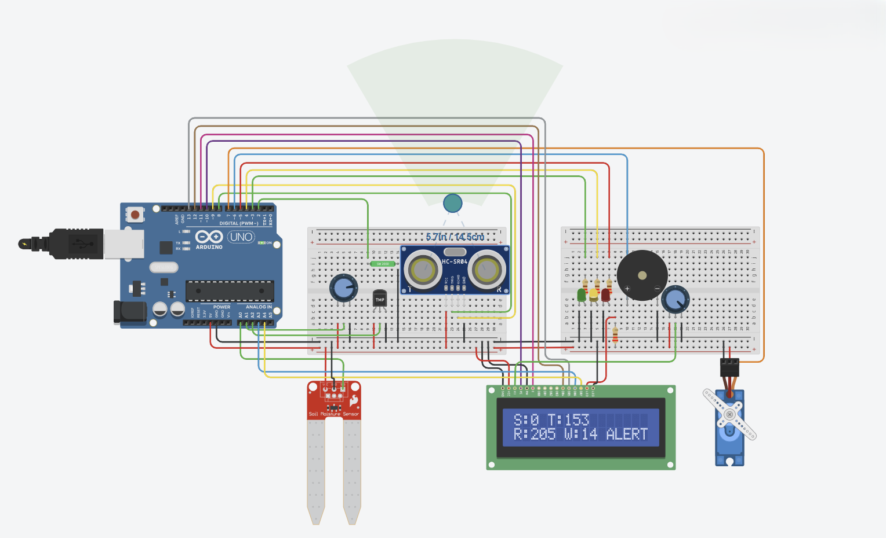

# Smart Disaster Monitoring System

## Overview

The Smart Disaster Monitoring System is an Arduino UNO-based project designed to monitor environmental conditions and provide early warning alerts for potential natural disasters such as landslides and floods.

The system continuously reads data from multiple sensors and automatically changes its alert level (SAFE, ALERT, or DANGER). It also controls LEDs, a buzzer, and a servo-operated barrier while displaying real-time information on a 16x2 LCD.

---

## Features

- Soil moisture monitoring
- Rain detection
- Temperature monitoring
- Water level detection using Ultrasonic Sensor
- Tilt detection for landslide monitoring
- 16x2 LCD live data display
- Three-level warning system
  - SAFE
  - ALERT
  - DANGER
- RGB LED indication
- Buzzer alarm
- Automatic barrier using Servo Motor

---

## Hardware Components

| Component | Quantity |
|-----------|----------|
| Arduino UNO | 1 |
| 16x2 LCD | 1 |
| Soil Moisture Sensor | 1 |
| Rain Sensor | 1 |
| Temperature Sensor (LM35 or similar) | 1 |
| Tilt Sensor | 1 |
| HC-SR04 Ultrasonic Sensor | 1 |
| Servo Motor (SG90) | 1 |
| LEDs (Green, Yellow, Red) | 3 |
| Buzzer | 1 |
| Breadboard | 1 |
| Jumper Wires | Several |
| USB Cable | 1 |

---

## Pin Connections

| Component | Arduino Pin |
|-----------|-------------|
| Soil Sensor | A0 |
| Rain Sensor | A1 |
| Temperature Sensor | A2 |
| Tilt Sensor | D2 |
| Green LED | D3 |
| Yellow LED | D4 |
| Red LED | D5 |
| Buzzer | D6 |
| Servo Motor | D7 |
| HC-SR04 Trigger | D8 |
| HC-SR04 Echo | D9 |
| LCD RS | D10 |
| LCD Enable | D11 |
| LCD D4 | D12 |
| LCD D5 | D13 |
| LCD D6 | A3 |
| LCD D7 | A4 |

---

## Working Principle

The Arduino continuously reads data from all connected sensors.

### SAFE

Conditions:
- Soil Moisture < 400
- Rain Sensor < 400
- Water Level > 20 cm
- Tilt Sensor Normal

Actions:
- Green LED ON
- Barrier Open
- LCD displays SAFE

---

### ALERT

Conditions:
- Soil Moisture between 400–700
- Rain between 400–700
- Water Level between 10–20 cm

Actions:
- Yellow LED ON
- Barrier Partially Closed
- LCD displays ALERT

---

### DANGER

Conditions:
- Soil Moisture > 700
- Rain > 700
- Water Level ≤ 10 cm
- Tilt Sensor Triggered

Actions:
- Red LED ON
- Buzzer Activated
- Barrier Fully Closed
- LCD displays DANGER

---

## Project Structure

```
Smart-Disaster-Monitoring-System/
│
├── SmartDisasterMonitoring.ino
├── README.md
├── LICENSE
├── circuit_diagram.png
├── project_demo.jpg
└── docs/
```

---

## How to Run

1. Install Arduino IDE.
2. Connect the Arduino UNO.
3. Install required libraries:
   - LiquidCrystal
   - Servo
4. Upload the sketch.
5. Connect all sensors according to the wiring table.
6. Open Serial Monitor if debugging is added.
7. Observe LCD and alert system.

---

## Future Improvements

- ESP8266 WiFi Integration
- Firebase Cloud Monitoring
- SMS Notifications
- Mobile Application
- GPS Tracking
- Real-time IoT Dashboard
- Machine Learning Prediction
- Solar Power Backup

---

## Applications

- Landslide Monitoring
- Flood Detection
- Rural Disaster Warning
- Smart Villages
- Environmental Monitoring
- Early Warning Systems

---
## Project Images

### Prototype



---

## Author

Pavan Samarakkodi

---

## License

This project is licensed under the MIT License.
